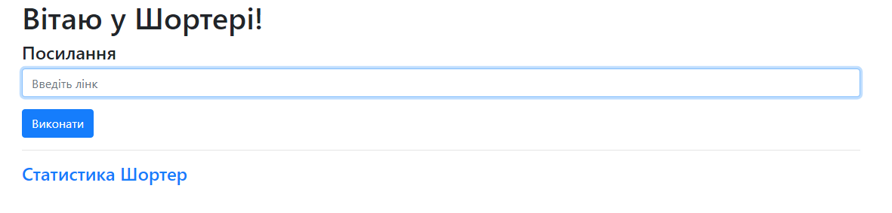
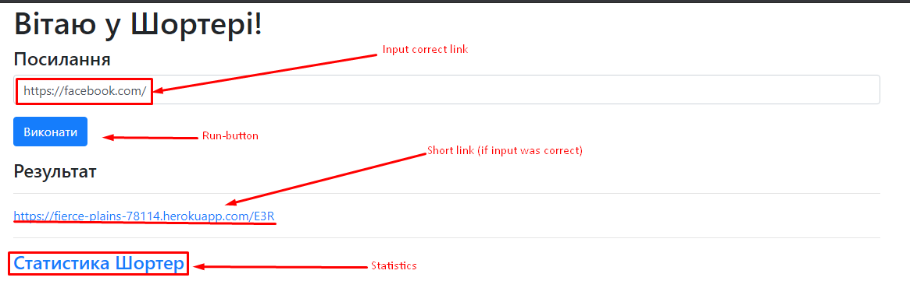
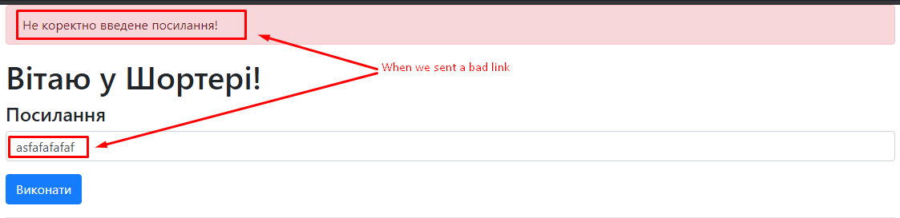
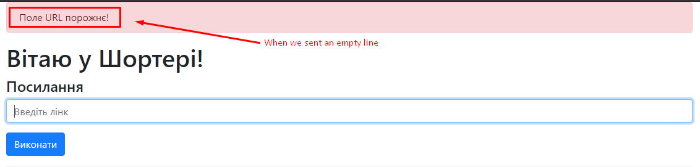
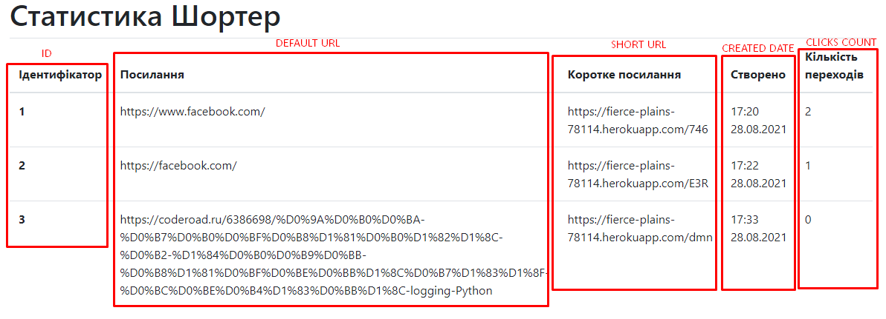
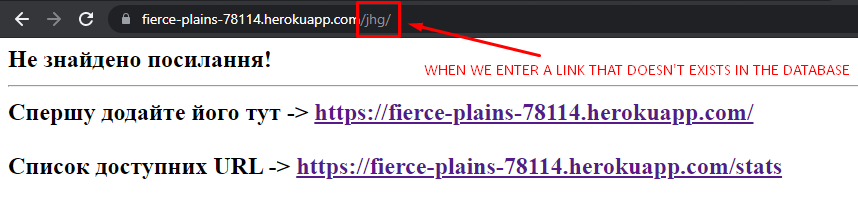

# Link-Shorter v1.0

## Table of contents
* [Description](#description)
* [Technologies](#technologies)
* [Work](#work)
* [Results](#results)
* [Installation](#installation)

##Description

This application helps to shorten a long link into a more readable form. The application uses Sqlite3 database to store and present information.

##Technologies

Project is developed with:
* Python version: 3.9.1
* Flask library version: 2.0.1
* Hashids library version: 1.3.1

##Work

When we go to the main page of the application we'll see this interface.



For successful execution, the user must enter a valid link which he wants to shorten the program.

User will be faced with this window when he'll write an incorrect link.

When he'll send an empty line.

This is the statistics of this application. Here we can see all the short links and other additional fields, such as the number of clicks on this link and the date of their creation.

When we try to follow a non-existent short link, we will be greeted by this window.


##Results
App deployed on Heroku:<br>
https://fierce-plains-78114.herokuapp.com/

##Installation

To run this project, install it locally using pip:
```
$ sudo pacman -S python git 
$ mkdir link-shorter && cd link-shorter
$ git clone https://github.com/a-khomitskyi/link-shorter.git
$ pip install -r requirements.txt
$ python app.py 
```
